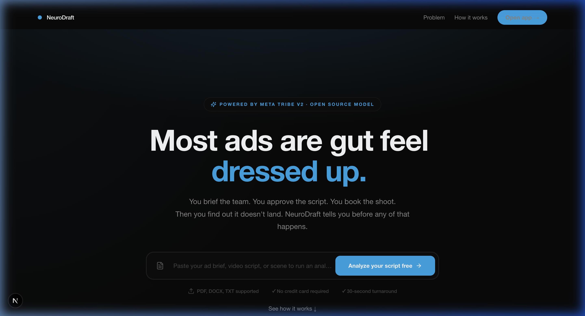
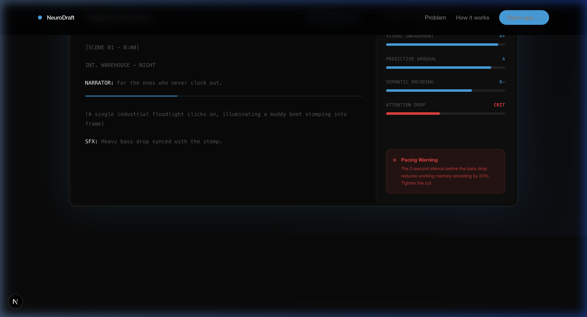
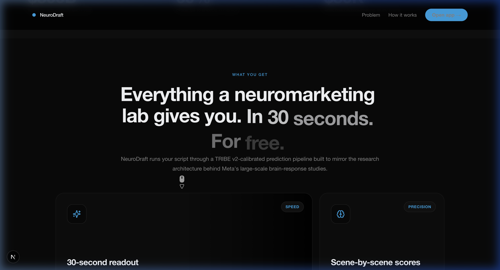
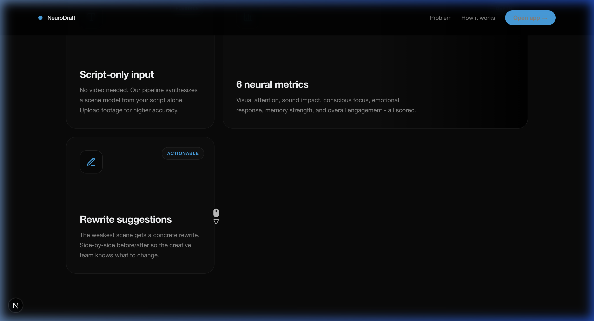
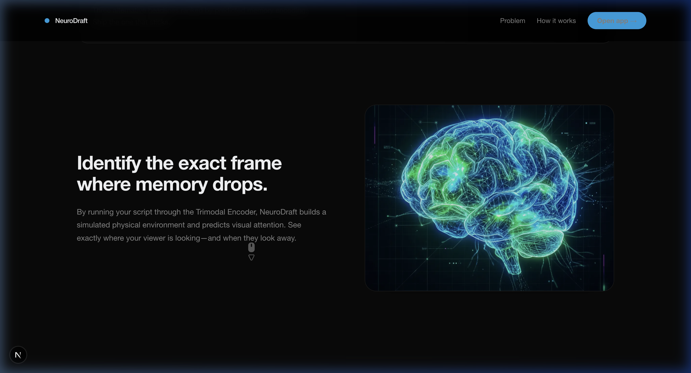
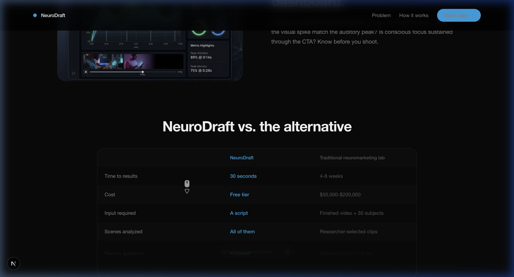
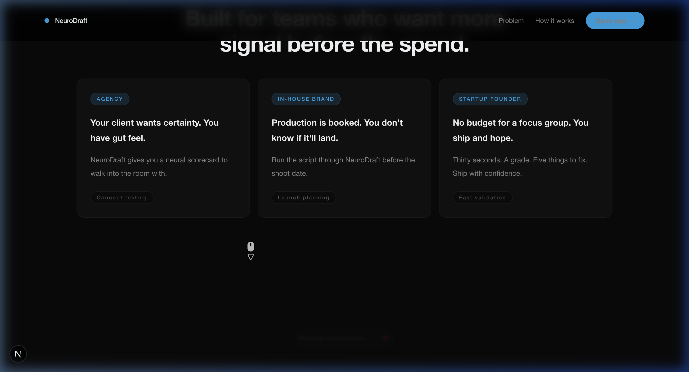
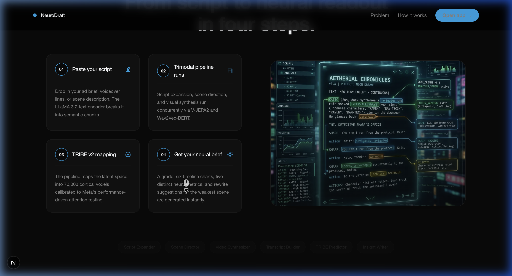
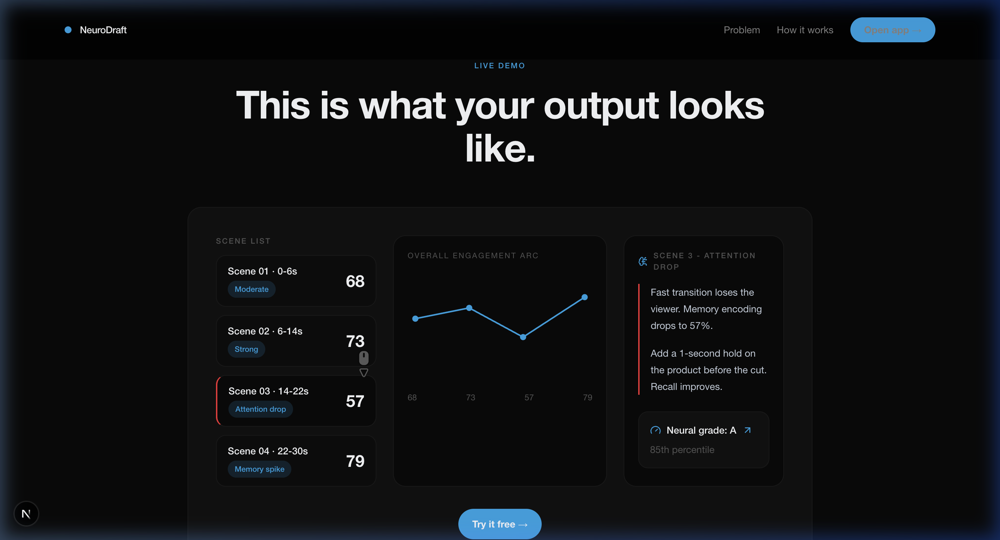
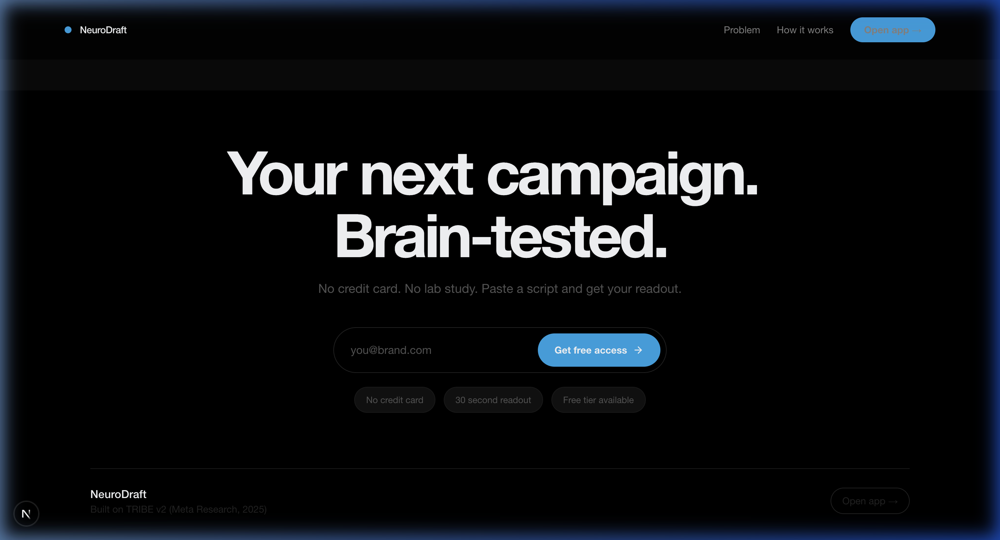

<div align="center">


<br/>

<p align="center">
  <strong>AI-powered creative intelligence — predict neural engagement from your ad script in ~30 seconds.</strong><br/>
  Built on <a href="https://ai.meta.com/research/publications/brain-bench/">TRIBE v2</a> · Powered by Groq + Gemini · Next.js 15
</p>

<br/>

<p align="center">
  
  
  
  
  
</p>

<br/>



</div>

---

## ✨ What is NeuroDraft?

NeuroDraft is an AI-powered creative intelligence tool that takes your ad script and returns a **predicted neural engagement report** in about 30 seconds. It tells you:

- 🧠 Which scenes will **hold attention** — and which lose the viewer
- 💥 What **emotion** each beat triggers in the brain
- 📝 Exactly **what to rewrite** to make the campaign stronger

It is built on **TRIBE v2** — a foundation model released by Meta's AI research team trained on over **1,000 hours of fMRI brain scans** from 720 subjects. NeuroDraft wraps that science into a workflow any creative team can use.

---

## 🚀 The Live Pipeline — 7 AI Agents, Simultaneously

When you paste an ad script into NeuroDraft, **6 AI agents fire simultaneously**, evaluated by a 7th:

<div align="center">

```
                    ┌────────────────────────────────────────────┐
                    │          You submit your script             │
                    └──────────────────┬─────────────────────────┘
                                       │
              ┌────────────────────────┴─────────────────────────┐
              │                                                   │
    ┌─────────▼──────────┐                          ┌────────────▼─────────┐
    │  1. Script Expander │                          │ 2. Transcript Builder │
    │  Scenes + timing    │                          │  Word-level breakdown │
    └─────────┬──────────┘                          └────────────┬─────────┘
              │                                                   │
    ┌─────────▼──────────┐                                       │
    │  3. Scene Director  │                                       │
    │  Visual brief/scene │                                       │
    └─────────┬──────────┘                                       │
              │                                                   │
    ┌─────────▼──────────┐                                       │
    │  4. Scene Preview   │                                       │
    │  AI storyboards     │                                       │
    └─────────┬──────────┘                                       │
              │                                                   │
              └───────────────────────┬───────────────────────────┘
                                      │
                           ┌──────────▼──────────┐
                           │  5. TRIBE Predictor  │
                           │  6 neural metrics    │
                           └──────────┬──────────┘
                                      │
                           ┌──────────▼──────────┐
                           │  6. Insight Writer   │
                           │  5 creative notes    │
                           └──────────┬──────────┘
                                      │
                           ┌──────────▼──────────┐
                           │  7. Quality Checker  │
                           │  Auto-reruns if bad  │
                           └─────────────────────┘
```

</div>

---

## 🖥️ Landing Page

<div align="center">







</div>

---

## 📊 The Dashboard — What You Get

<div align="center">







</div>

For every ad script you analyze, you get:

| Output | Description |
|--------|-------------|
| 🎓 **Neural Grade** | A–F letter grade + benchmark percentile vs. other ads |
| 📈 **6 Metric Scores** | Visual attention, sound impact, conscious focus, emotional response, memory strength, overall engagement |
| 〰️ **Engagement Arc** | Does attention rise, fall, or stay volatile across scenes? |
| 💡 **5 Creative Insights** | Each with a finding + concrete recommendation |
| ✍️ **Scene Rewrite** | The weakest scene rewritten, with before/after |
| 🔤 **Headline Recall Test** | 3 alternative headlines ranked by predicted memory |
| ✅ **Quality Score** | How reliable is this analysis? |
| 📄 **PDF Report** | 4-page download — no server needed |

---

## 🧠 The Six Neural Metrics

<div align="center">

| Metric | Brain Region | What It Measures |
|--------|-------------|------------------|
| 👁️ **Visual Attention** | Visual cortex | How much the eye is drawn to and holds on the image |
| 🔊 **Sound Impact** | Auditory cortex | How well audio reinforces the message and emotion |
| 🎯 **Conscious Focus** | Prefrontal cortex | Whether the viewer is actively following the story |
| ❤️ **Emotional Response** | Amygdala | Strength of emotional reaction — positive or negative |
| 🗄️ **Memory Strength** | Hippocampus | How likely this scene is remembered the next day |
| ⚡ **Overall Engagement** | Whole brain | Is the brain active and receptive? |

</div>

> Scores above **0.70** are strong. Below **0.40** is a warning zone.

---

## 🌟 Social Proof & CTA

<div align="center">







</div>

---

## 🗂️ Project Structure

```text
NeuroDraft/
├── app/                         # SaaS analysis tool (Next.js 15, port 3000)
│   ├── app/
│   │   ├── analyze/             # Main workspace — paste script, run analysis
│   │   └── results/[id]/        # Full results deep-dive page
│   ├── api/
│   │   ├── pipeline/            # Start pipeline, SSE status stream
│   │   └── agents/              # Six agent routes + evaluator
│   ├── components/
│   │   └── pipeline/            # AgentCard, NeuralHeatmap, InsightPanel, etc.
│   └── lib/
│       ├── pipeline.ts          # Background orchestrator
│       ├── event-bus.ts         # SSE in-memory event bus
│       ├── results-store.ts     # In-memory result storage
│       └── groq.ts              # Groq client + retry logic
│
└── landing/                     # Marketing site (Next.js 15, port 3001)
    ├── app/
    │   └── page.tsx             # Full marketing page
    └── components/
        ├── Hero.tsx
        ├── HeroAppMockup.tsx    # Interactive dashboard preview
        ├── Features.tsx
        ├── HowItWorks.tsx
        ├── SocialProofMarquee.tsx
        └── CTA.tsx
```

---

## ⚡ Quick Start

### Prerequisites

- Node.js 18+
- [Groq API key](https://console.groq.com) (free)
- [Google Gemini API key](https://aistudio.google.com) (free)

### 1 — Clone & Install

```bash
git clone https://github.com/PRAFULREDDYM/NeuroDraft.git
cd NeuroDraft
npm install
```

### 2 — Environment Variables

```bash
cp app/.env.example app/.env.local
cp landing/.env.example landing/.env.local
```

Edit `app/.env.local`:

```env
GROQ_API_KEY=your_groq_key_here
GEMINI_API_KEY=your_gemini_key_here
NEXT_PUBLIC_APP_URL=http://localhost:3000
NEXT_PUBLIC_LANDING_URL=http://localhost:3001
```

| File | Purpose |
|------|---------|
| `app/.env.local` | Real API keys — **never commit** |
| `landing/.env.local` | Public URLs for the marketing site |
| `app/.env.example` | Safe template to copy from |

### 3 — Run Both Apps

**From the root (recommended):**

```bash
# Terminal 1
npm run dev:app       # → http://localhost:3000

# Terminal 2
npm run dev:landing   # → http://localhost:3001
```

### 4 — Try It

1. Open `http://localhost:3001` → landing page
2. Click **"Analyze your script free →"**
3. Paste any ad script (minimum 15 words)
4. Click **"Analyze Brain Response"**
5. Watch the 6 agent cards light up in real-time
6. Read your neural grade, heatmap, and insights
7. Click **"Download report"** for the PDF

---

## 🧪 Test Script

Use this script to verify your setup — it has strong humor and emotional hooks, so neural scores should be high:

```
A man wakes up to an alarm that won't stop. He knocks it off the table. 
It still rings. A Red Bull can rolls into frame. Text: Mornings exist. 
On a packed train, squeezed between two large people, he tilts his entire 
body sideways to sip his Red Bull. Text: You still have to show up. 
In a meeting that could have been an email, a woman sips Red Bull under 
the table like contraband. Text: It won't end. But you will survive it. 
Voiceover: Red Bull. Life is relentless. So are we.
```

**Expected output:** Neural grade **A** or strong **B**, emotional arousal above **0.75**, memory encoding above **0.70** on the humor scenes.

---

## 📡 How the Pipeline Works — Technically

```
User submits script
       │
       ▼
POST /api/pipeline/start
       │
       ├─── [PARALLEL] Script expansion   (Groq LLaMA 3)
       ├─── [PARALLEL] Transcript builder (Groq LLaMA 3)
       ▼
Scene preview generation                  (Gemini)
       ▼
TRIBE scoring                             (Groq LLaMA 3)
       ▼
Insight writing                           (Groq LLaMA 3)
       ▼
Quality verification                      (Groq LLaMA 3)
       ▼
Result stored → /results/[runId]
```

The frontend connects to `/api/pipeline/status?runId=xxx` via **Server-Sent Events (SSE)**. Every agent emits progress events through this stream — that's why agent cards animate in real time.

> **Note on persistence:** Results are stored in a Node.js `Map`. Results are lost on server restart. For production, swap `results-store.ts` with Redis or a DB.

---

## 🚀 Deployment

### Option A — Vercel (Recommended)

```bash
# Deploy the app
cd NeuroDraft/app && npx vercel

# Deploy the landing
cd NeuroDraft/landing && npx vercel
```

**Environment variables to add in Vercel dashboard:**

| Variable | Required in |
|----------|-------------|
| `GROQ_API_KEY` | app |
| `GEMINI_API_KEY` | app |
| `NEXT_PUBLIC_APP_URL` | both |
| `NEXT_PUBLIC_LANDING_URL` | both |

> ⚠️ Vercel Hobby has a **60-second** API timeout. The pipeline runs in **25–45 seconds**. Upgrade to Pro if you consistently hit timeouts.

### Option B — Self-Hosted (Railway / Render / Fly.io)

All three platforms support standard Next.js. Set the same environment variables above.

---

## 🔌 MCP Integration (Claude Desktop + Cursor)

NeuroDraft exposes **3 tools** via the Model Context Protocol:

| Tool | What it does |
|------|-------------|
| `analyze_ad_script` | Runs the full pipeline, returns a markdown report |
| `get_analysis_result` | Retrieves a completed analysis by run ID |
| `compare_scripts` | Runs two scripts in parallel, returns a side-by-side winner |

### Setup

```bash
# 1. Make sure the app is running
cd app && npm run dev

# 2. Build the MCP server
cd app && npm run mcp:build
```

Add to your Claude Desktop config (`~/Library/Application Support/Claude/claude_desktop_config.json`):

```json
{
  "mcpServers": {
    "neurodraft": {
      "command": "node",
      "args": ["/absolute/path/to/NeuroDraft/app/mcp/dist/server.js"],
      "env": {
        "NEURODRAFT_URL": "http://localhost:3000"
      }
    }
  }
}
```

Then ask Claude:
> *"Analyze this ad script using NeuroDraft: [paste script]"*
> *"Compare these two campaign versions and tell me which has stronger memory encoding"*

---

## 💰 API Costs

| Service | Used For | Free Tier |
|---------|----------|-----------|
| **Groq** | Script expansion, transcript, scoring, insights | Generous developer free tier |
| **Gemini** | Scene storyboard generation | Good for light testing |

Production cost: roughly **cents per analysis** depending on script length and traffic.

---

## ⚠️ Known Limitations

1. **No real TRIBE v2 GPU inference** — Scores are LLM-calibrated predictions based on TRIBE v2's documented output patterns, not actual fMRI model inference
2. **In-memory storage** — Results disappear on server restart
3. **No user authentication** — MVP and demo-friendly build
4. **Scene preview uses storyboard mode** — Intentional for free-tier compatibility

---

## 🤝 Contributing

This is an MVP built for speed. Contributions welcome:

- 🗄️ Replace in-memory storage with Redis
- 🧬 Add real TRIBE inference via a GPU endpoint
- 👤 Add user accounts + history
- 🎨 Richer preview generation
- 📊 Extend the neural schema

Pull requests welcome. Open an issue first for large changes.

---

## 📖 What TRIBE v2 Actually Is

**TRIBE v2** (TRImodal Brain Encoder, version 2) is a foundation model released by Meta's research team, trained on **1,000+ hours of brain scan data** from **720 volunteers** who watched movies and listened to podcasts inside MRI machines.

The model learned to predict what brain activity patterns occur in response to combinations of **video, audio, and text simultaneously**.

NeuroDraft uses TRIBE v2 as the scientific basis for its scoring system — specifically the documented relationships between humor, surprise, pacing, emotional intensity, and memory formation.

---

<div align="center">


</div>
